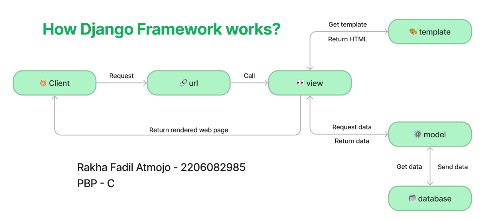
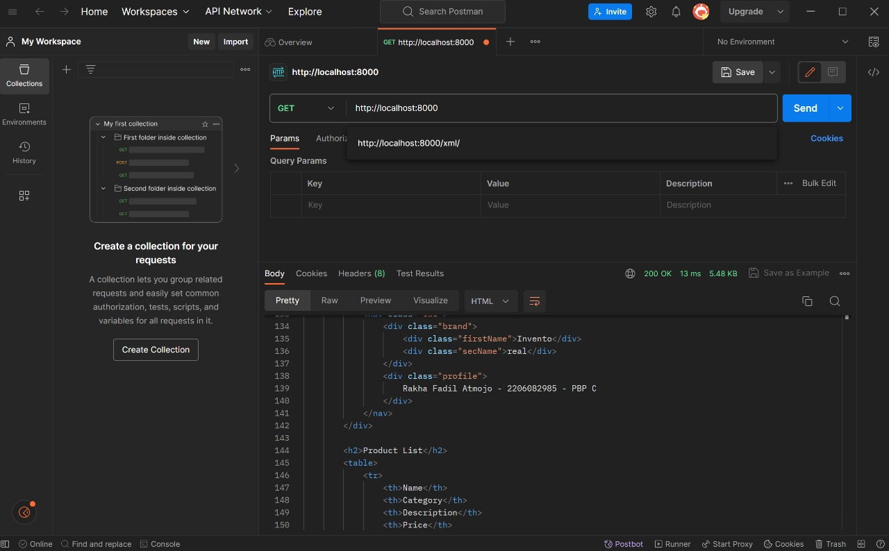
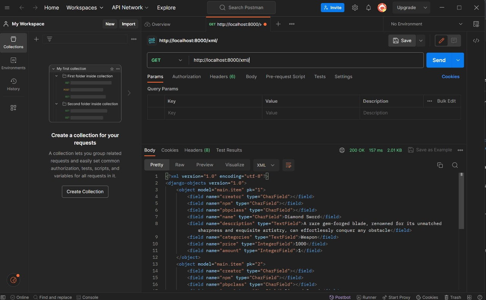
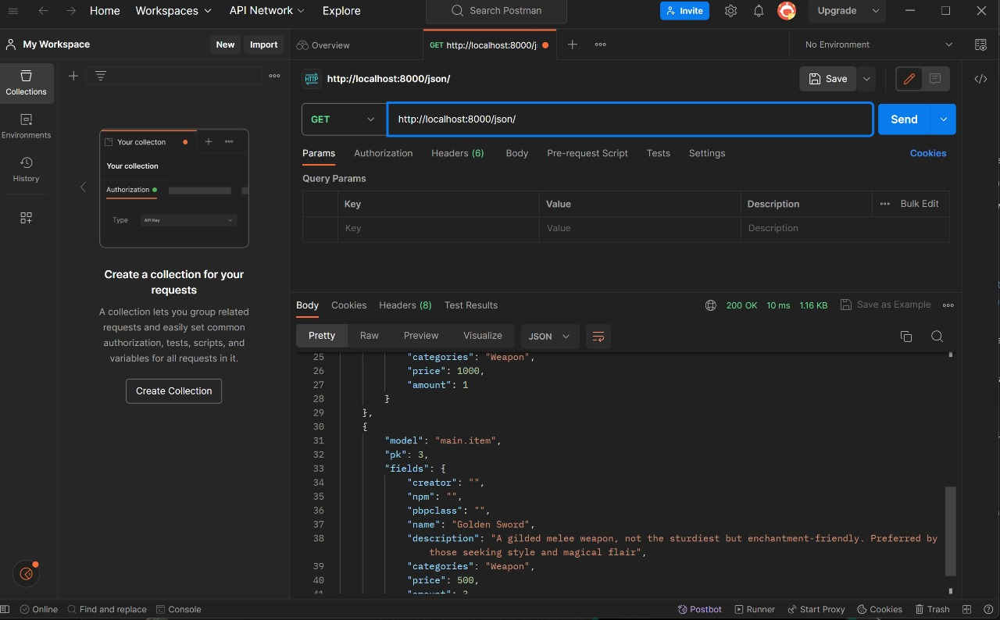
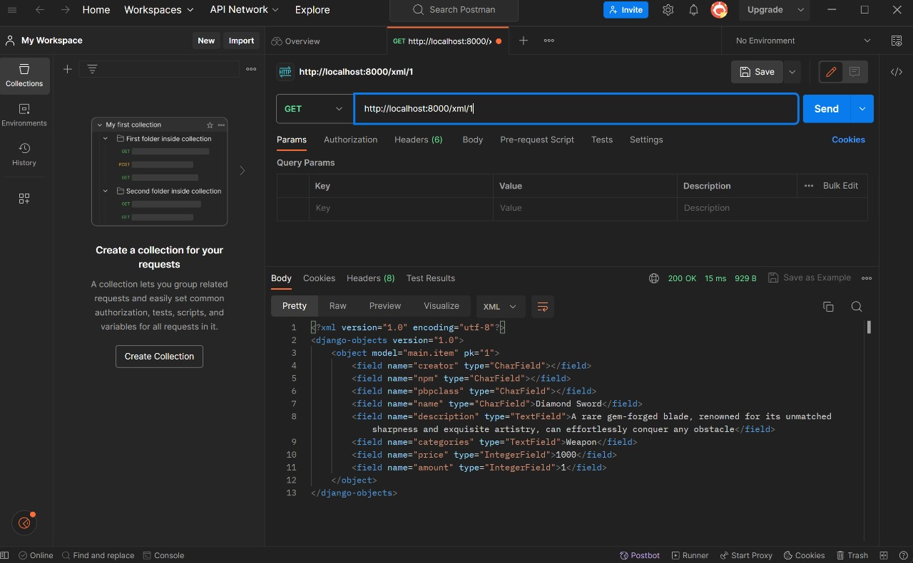
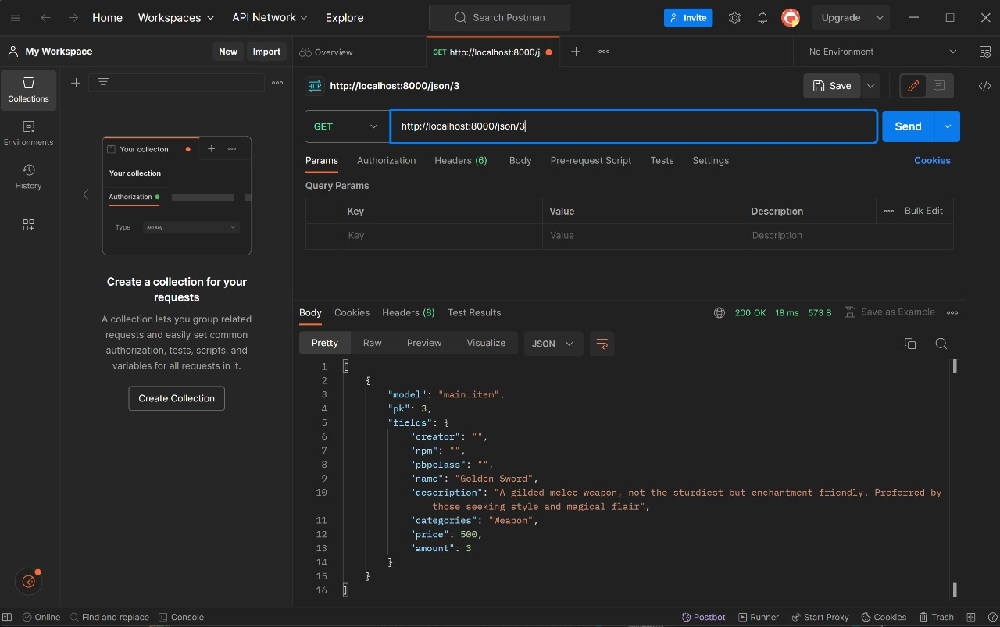
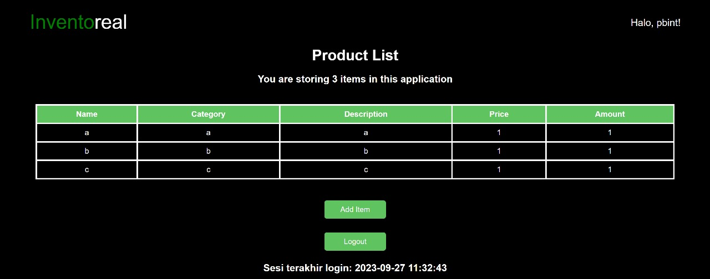
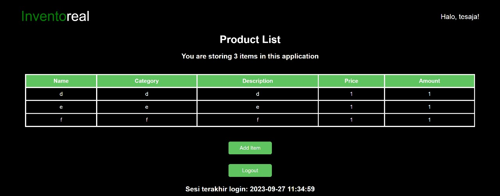

# Inventoreal

Tautan menuju aplikasi adaptable Inventoreal bisa diakses melalui [tautan ini](https://inventoreal.adaptable.app/).

# Tugas 2
## **Cara membuat proyek Django baru**

1. Buat direktori baru dengan nama yang Anda inginkan, misalnya `inventoreal` dan buka command prompt (untuk Windows) atau terminal shell di dalam direktori tersebut.

2. Buat virtual environment dengan perintah `python -m venv env` untuk mengisolasi proyek Python kita dan aktifkan virtual environment dengan perintah `env\Scripts\activate.bat` (Windows) atau `source env/bin/activate` (Linux/Mac).

3. Buat file `requirements.txt` di dalam direktori proyek dan isi dengan daftar dependencies yang dibutuhkan untuk proyek Anda.

4. Install dependencies dengan perintah `pip install -r requirements.txt`, kemudian buat proyek Django dengan menjalankan perintah `django-admin startproject (nama_app) .`. Nama_app disesuaikan dengan keinginan, dan ini akan membuat folder baru dengan nama tersebut.

5. Buka file `settings.py` yang ada di dalam folder proyek, cari variabel `ALLOWED_HOSTS` dan ubah nilainya menjadi `["*"]` untuk mengizinkan akses dari semua host.

6. Kembali ke command prompt atau terminal dan jalankan server dengan perintah `python manage.py runserver` di dalam direktori proyek (pastikan ada file `manage.py` di sana).

7. Kita dapat membuka proyek Django baru di browser dengan mengakses http://localhost:8000. Jika melihat animasi roket, maka proyek Django sudah berhasil.

8. Untuk menghentikan server, cukup tekan `Ctrl+C` di command prompt atau terminal. Jangan lupa untuk nonaktifkan virtual environment dengan perintah `deactivate`.

> [!NOTE]
> Jika ingin mengunggah proyek ke github, disarankan membuat file `.gitignore` untuk menentukan berkas dan direktori yang harus diabaikan oleh Git.

## **Cara membuat aplikasi dengan nama `main` pada proyek**

1. Buka command prompt pada direktori utama dan aktifkan virtual environment dengan perintah `env\Scripts\activate.bat`.

2. Jalankan perintah `python manage.py startapp main` untuk membuat folder baru bernama `main`.

3. Mendaftarkan aplikasi `main` ke proyek dengan membuka file `settings.py` dalam direktori proyek dan menambahkan `'main'` pada variabel `INSTALLED_APPS`.

## **Cara membuat model pada aplikasi `main`**

1. Buka file `models.py` dan isi file tersebut dengan nama `Items` dan atribut-atribut dan tipe data yang ingin digunakan. Dalam program ini, ada 3 atribut wajib (name, amount, description) dan 2 atribut tambahan (category, price).

```py
from django.db import models

class Items(models.Model):
    name = models.CharField(max_length=255)
    description = models.TextField()
    categories = models.CharField(max_length=255)
    price = models.IntegerField()
    amount = models.IntegerField()
```

2. Jalankan perintah `python manage.py makemigrations` untuk mempersiapkan migrasi skema model ke dalam database Django lokal.

3. Jalankan perintah `python manage.py migrate` untuk menerapkan skema model yang telah dibuat ke dalam database Django lokal.

> [!IMPORTANT]
> Setiap kali ada perubahan pada model (menambahkan / mengurangi / mengganti atribut), wajib untuk melakukan migrasi untuk merefleksikan perubahan itu

## **Cara membuat sebuah fungsi pada views.py untuk dikembalikan ke dalam sebuah template HTML**

1. Buat direktori baru bernama `templates` di dalam direktori aplikasi `main` dan buat file `main.html` di dalamnya

2. Buka file `views.py` dalam direktori `main` dan tambahkan `from django.shortcuts import render` untuk mengimpor fungsi render dari modul django.shortcuts untuk me-render tampilan HTML dengan menggunakan data yang diberikan.

```py
from django.shortcuts import render
```

3. Buat fungsi `show_main` dengan 1 parameter (anggap namanya `request`) dan di dalam fungsinya, buat sebuah dictionary yang berisi data yang akan dikirimkan ke tampilan yang kemudian di return dengan fungsi `render` dengan 3 argumennya, yaitu `request` (objek permintaan HTTP yang dikirim oleh pengguna), nama file html yang digunakan untuk me-_render_ tampilan, dan `context` (dictionary yang berisi data untuk digunakan dalam penampilan dinamis). Berikut adalah contohnya.

```py
def show_main(request):
    context = {
    'creator' : 'Rakha Fadil Atmojo',
        'npm' : 2206082985,
        'pbpclass' : 'PBP C',
        'items': [
            {
                'name': 'Diamond Sword',
                'category': 'Weapon',
                'price': 1000,
                'amount': 1,
                'description': 'A rare gem-forged blade, renowned for its unmatched sharpness and exquisite artistry, can effortlessly conquer any obstacle.',
            },
            ...
        ]
    }

    return render(request, "main.html", context)
```

4. Buka file `main.html` tadi dan ubah kode yang sebelumnya dibuat secara statis menjadi kode Django yang sesuai untuk menampilkan data. Gunakan sintaksis Django yang menggunakan tanda kurung ganda ganda `({{ }})` untuk memasukkan data dari dictionary data yang dikirimkan oleh fungsi `show_main`

## **Cara membuat sebuah routing pada urls.py aplikasi `main` untuk memetakan fungsi yang telah dibuat pada views.py**

1. Buat file `urls.py` di dalam direktori `main` (jika belum ada) dan import modul path dari `django.urls` dan juga import views yang telah dibuat sebelumnya di `views.py`.

```py
from django.urls import path
from main.views import show_main
```

2. Tambahkan urlpatterns untuk menghubungkan path dengan fungsi yang telah Anda buat di `views.py`, yaitu `show_main`

```py
app_name = 'main'

urlpatterns = [
    path('', show_main, name='show_main'),
]
```

## **Cara melakukan routing pada proyek agar dapat menjalankan aplikasi `main`**

1. Buka berkas `urls.py` di dalam direktori proyek `inventoreal` dan import modul `include` dari `django.urls` (`from django.urls import path, include`) untuk melakukan konfigurasi routing tampilan `main`

2. Di dalam variabel urlpatterns, tambahkan path yang akan mengarahkan ke aplikasi 'main', bisa menggunakan `include()` untuk menghubungkan ke file `urls.py` di aplikasi 'main'.

```python
urlpatterns = [
    path('main/', include('main.urls')),
    path('admin/', admin.site.urls),
    path('', include('main.urls')),
]
```

## **Cara _deployment_ aplikasi ke Adaptable**

1. Setelah login, pilih "New App" dan "Connect an Existing Repository".

2. Hubungkan Adaptable.io dengan GitHub, pilih "All Repositories" (jika baru pertama kali menghubungkan).

3. Pilih repositori proyek aplikasi yang telah diunggah ke github dan branch untuk _deployment_.

4. Pilih template deployment "Python App Template" dan pilih PostgreSQL sebagai tipe basis data.

5. Sesuaikan versi Python dengan yang dibutuhkan (cek menggunakan perintah `python --version` pada command prompt).

6. Isi Start Command dengan `python manage.py migrate && gunicorn (nama direktori utama).wsgi`.

7. Tentukan nama aplikasi yang juga akan menjadi nama domain situs web.

8. Centang "HTTP Listener on PORT" dan klik "Deploy App" untuk memulai proses deployment aplikasi.

## **Bagan yang berisi request client ke web aplikasi berbasis Django beserta responnya**


Dalam web aplikasi Django, ketika client mengirimkan permintaan HTTP, Django menggunakan berkas `urls.py` untuk menentukan view yang sesuai. View dalam berkas `views.py` mengatur logika aplikasi, termasuk interaksi dengan models dalam `models.py` untuk mengakses dan memodifikasi data basis data. Data yang diperlukan untuk merender tampilan dikumpulkan dalam view, dan hasilnya dirender menggunakan berkas HTML. Berkas HTML mengandung kode HTML dan tag-template Django untuk memasukkan data dari view. Setelah selesai dirender, tampilan tersebut dikirim sebagai respon ke client, membentuk aliran pengembangan yang terstruktur dalam Django: `urls.py` mengelola routing, `views.py` mengatur logika, `models.py` mengelola data, dan berkas HTML mengontrol tampilan, menciptakan aplikasi web yang berfungsi dengan baik.

## **Mengapa kita menggunakan virtual environment?**

Virtual environment adalah komponen penting dalam pengembangan perangkat lunak Python, termasuk aplikasi web berbasis Django, karena mengatasi berbagai tantangan yang muncul dalam mengelola proyek dengan spesifikasi yang berbeda-beda. Dengan menggunakan virtual environment, kita menciptakan lingkungan Python yang terisolasi untuk setiap proyek, yang memungkinkan kita mengelola dependensi, versi Python, dan konfigurasi yang sesuai dengan proyek tersebut tanpa khawatir tentang konflik dengan proyek lain atau pengaruh terhadap instalasi Python sistem. File `requirements.txt` membantu merekam daftar dependensi yang diperlukan oleh proyek, memudahkan replikasi lingkungan pengembangan di berbagai mesin. Ini tidak hanya penting dalam pengembangan tim untuk menjaga konsistensi konfigurasi, tetapi juga membantu dalam manajemen dependensi yang efisien. Selain itu, virtual environment membantu menjaga keamanan proyek dengan mengisolasi lingkungan dari pustaka atau komponen lain yang terinstal secara global atau dalam proyek lain, serta mencegah konflik yang mungkin timbul akibat penggunaan yang tidak terduga.

## **Apakah kita tetap dapat membuat aplikasi web berbasis Django tanpa menggunakan virtual environment?**

Meskipun teknisnya memungkinkan kita untuk membuat aplikasi web berbasis Django tanpa menggunakan virtual environment, namun hal itu sangat tidak dianjurkan. Penggunaan virtual environment dalam pengembangan Django adalah standar yang sangat penting. Tanpa virtual environment, proyek akan bergantung pada instalasi Python sistem yang ada di komputer kita, yang dapat menyebabkan masalah rumit. Salah satunya adalah konflik dependensi, di mana proyek-proyek yang berbeda memerlukan versi pustaka yang berbeda. Selain itu, jika tanpa menggunakan virtual environment, akan menghadapi tantangan dalam manajemen dependensi, ketergantungan global pada lingkungan Python sistem, dan potensi masalah keamanan. Dengan menggunakan virtual environment, kita menciptakan lingkungan Python yang terisolasi untuk setiap proyek, memungkinkan untuk mengelola dependensi, versi Python, dan keamanan proyek secara independen. Ini juga memudahkan manajemen dependensi dan mencegah konflik antara proyek-proyek kita, menjaga kebersihan, stabilitas, dan keamanan dalam pengembangan proyek selanjutnya.

## **Jelaskan apakah itu MVC, MVT, MVVM dan perbedaan dari ketiganya**

MVC (Model-View-Controller), MVT (Model-View-Template) dan MVVM (Model-View-ViewModel) adalah pola arsitektur perangkat lunak yang digunakan dalam pengembangan aplikasi untuk memisahkan komponen aplikasi dari aplikasi yang berbeda agar lebih terstruktur dan sederhana. untuk mengelola. Meskipun memiliki kesamaan dalam pembagian tugas, namun digunakan dalam konteks yang berbeda dan terdapat perbedaan dalam cara pengorganisasian komponen-komponen tersebut.

### MVC (Model - View - Controller)
| **Model** | **View** | **Controller** |
| --- | --- | --- |
| Representasi data dan aturan bisnis dari aplikasi. Ini adalah bagian yang bertanggung jawab untuk mengakses dan memanipulasi data, baik dari database atau sumber lainnya. Model juga menentukan logika bisnis, seperti validasi data dan perhitungan. Misalnya, jika kita ingin mengembangkan aplikasi e-commerce, model akan mengatur cara data produk, pelanggan, dan pesanan disimpan dan diakses | Bagian yang menangani tampilan kepada pengguna. Ini adalah apa yang dilihat pengguna saat berinteraksi dengan aplikasi yang kita buat. View bertugas hanya untuk mengambil data dari model dan menuangkannya ke layar. Contohnya dalam aplikasi e-commerce, view akan memperlihatkan daftar produk dan detail pesanan kepada pengguna | Bagian yang bertindak sebagai perantara antara model dan view. Ini mengelola alur informasi dalam aplikasi. Controller menangani permintaan pengguna, memprosesnya, dan mengirimkannya ke Model untuk memperbarui data atau mengambil data yang diperlukan. Misalnya pada aplikasi e-commerce. Jika pengguna menambahkan produk ke keranjang belanja, controller akan mengatur supaya model menyimpan data tersebut dan kemudian memberi tahu view untuk memperbarui tampilan |

### MVT (Model - View - Template)
| **Model** | **View** | **Template** |
| --- | --- | --- |
| Sama seperti MVC, model adalah komponen konsep MVT yang bertanggung jawab untuk mengatur dan mengelola data aplikasi. Model mewakili struktur data dan logika aplikasi di balik tampilan. Model menghubungkan aplikasi ke database dan mengelola interaksi dengan data tersebut | Komponen yang mengatur logika presentasi dalam konsep MVT. View ini mengontrol cara data yang dikelola model ditampilkan kepada pengguna. Dalam konteks MVT, tampilan bertindak sebagai pengatur yang menampilkan dan mengambil data dari model untuk dipresentasikan kepada pengguna | Bagian yang bertanggung jawab untuk mengatur tampilan pengguna, contohnya seperti halaman web. Dalam kerangka kerja seperti Django, Template digunakan untuk merancang tampilan halaman web dan menggabungkan data dari Model sehingga pengguna dapat melihat informasi yang dihasilkan melalui view |

### MVVM (Model - View - ViewModel)
| **Model** | **View** | **ViewModel** |
| --- | --- | --- |
| Komponen yang mengelola data dan logika aplikasi, serupa dengan Model dalam MVC dan MVT. Model dan ViewModel pada MVVM ini nantinya akan bekerja sama untuk mengambil dan menyimpan data | Komponen yang bertanggung jawab untuk menampilkan tampilan dan memberi tahu ViewModel tentang tindakan pengguna. Namun, dalam MVVM, View berfungsi sebagai penampil pasif yang hanya menampilkan data dan tidak mengandung logika aplikasi apapun | Salah satu komponen utama dalam MVVM yang bertindak sebagai jembatan antara Model dan View. ViewModel mengubah data dari Model menjadi format yang dapat ditampilkan oleh View dan mengelola logika tampilan. Misalnya, jika kita memiliki aplikasi cuaca, ViewModel akan mengambil data cuaca dari Model dan merubahnya menjadi format yang dapat ditampilkan oleh View, seperti ikon cuaca, suhu, dan deskripsi |

### Perbedaan MVC, MVT, dan MVVM

#### MVC

MVC adalah pola desain yang telah digunakan dalam berbagai jenis aplikasi, termasuk aplikasi desktop, web, dan mobile. Ini adalah konsep yang serbaguna dan diterapkan secara luas. Dalam MVC, Controller memiliki peran yang cukup aktif dalam mengatur aliran informasi antara Model dan View. Model dan View juga dapat berinteraksi secara langsung dalam beberapa kasus. Dalam kata lain, MVC terfokus pada pemisahan tugas dengan Model yang mengelola data dan logika bisnis, View yang menampilkan data, dan Controller yang mengatur aliran informasi dan dalam MVC, developer harus sering mengelola secara manual pembaruan tampilan setiap kali data berubah. Ini dapat memerlukan kode tambahan untuk menghubungkan Model dan View.

#### MVT

MVT adalah konsep yang utamanya digunakan dalam pengembangan web dengan menggunakan kerangka kerja Django yang berbasis Python. Salah satu komponen istimewanya, yaitu Template (dalam MVT (Django)), dikhususkan mengatur tampilan halaman web, sedangkan Model dan View berperan seperti dalam MVC. Template adalah komponen tambahan yang tidak ada dalam MVC tradisional dan _framework_ ini memiliki alat bawaan untuk mengurus pembaruan tampilan secara otomatis ketika data berubah.

#### MVVM

MVVM sering digunakan dalam pengembangan aplikasi berbasis antarmuka pengguna (UI), seperti aplikasi mobile atau desktop. Ini memiliki fokus untuk memisahkan tugas tampilan dan logika dalam UI. Adanya ViewModel yang bertindak sebagai perantara antara Model dan View memungkinkan keduanya untuk tetap terpisah dan mengurangi ketergantungan antara keduanya. MVVM ini mengandalkan sistem pengikatan data (_data binding_) untuk secara otomatis memperbarui tampilan ketika data berubah di ViewModel. Ini mengurangi kode boilerplate yang diperlukan untuk pembaruan tampilan, tetapi jika _data binding_ tersebut sangat kompleks, akan sedikit lebih sulit untuk melakukan _debugging_ aplikasinya

# Tugas 3
## **Cara mengimplementasikan _Skeleton_ sebagai Kerangka Views**
1. Buat folder bernama `templates` di dalam root folder dan buatlah file bernama `base.html`. Isi file tersebut dengan kode di bawah ini.
```html

<!DOCTYPE html>
<html lang="en">
    <head>
        <meta charset="UTF-8" />
        <meta
            name="viewport"
            content="width=device-width, initial-scale=1.0"
        />
        
        
    </head>

    <body>
        
        
    </body>
</html>
```
2. Buka `settings.py` pada subdirektori `inventoreal` dan cari variabel `TEMPLATES` yang bertipe data list of dictionaries, kemudian sesuaikan value dari key `DIRS` untuk mengarahkan ke folder `templates` yang telah dibuat sebelumnya.
```py
TEMPLATES = [
    {
        ...
        'DIRS': [BASE_DIR / 'templates'],
        ...
    }
]
```
3. Pada `main/templates/main.html`, tambahkan kode di bawah ini untuk meng-_extend_ dari `base.html` yang baru saja dibuat.
```html


    ...
    //kode html yang telah dibuat sebelumnya
    ...

```

## **Cara membuat input form untuk menambahkan objek model pada aplikasi**
1. Jalankan virtual environment terlebih dahulu. Untuk windows, menggunakan command `env\Scripts\activate.bat` dan untuk unix menggunakan command `source env/bin/activate`

2. Kita implementasikan dahulu sebuah skeleton sebagai kerangka viewsnya. Untuk tata caranya, silahkan mengikuti [link ini](#cara-mengimplementasikan-skeleton-sebagai-kerangka-views)

3. Buat file terbaru, yaitu `forms.py` pada folder `main` yang bertujuan untuk membuat struktur form yang dapat menerima data produk baru saat diinput, dan tambahkan kode di bawah ini
```py
from django.forms import ModelForm
from main.models import Item

class ItemForm(ModelForm):
    class Meta:
        model = Item
        fields = ["name", "category", "price", "amount", "description"]
```
> [!NOTE]
> isi variabel `fields` disesuaikan dengan informasi / variabel apa saja yang ingin diminta dari user

4. Buka file `main/views.py` dan tambahkan beberapa import serta function `create_item` untuk menghasilkan form yang dapat menambahkan data produk secara otomatis ketika data di-_submit_ dari form
```py
from django.http import HttpResponseRedirect
from main.forms import ProductForm
from django.urls import reverse
...
def create_item(request):
    form = ItemForm(request.POST or None)

    if form.is_valid() and request.method == "POST":
        form.save()
        return HttpResponseRedirect(reverse('main:show_main'))

    context = {'form': form}
    return render(request, "create_item.html", context)
```

## **Cara menambahkan fungsi views untuk melihat objek yang sudah ditambahkan (HTML, XML, JSON, XML by ID, dan JSON by ID)**
### **HTML**
1. Pada file `main/views.py`, ubah function `show_main` untuk mengambil seluruh object Item yang tersimpan pada database
```py
def show_main(request):
    items = Item.objects.all()
    context = {
        'creator' : 'Rakha Fadil Atmojo',
        'npm' : 2206082985,
        'pbpclass' : 'PBP C',
        'item' : items,
    }
    return render(request, "main.html", context)
```

2. Buka `main/urls.py`, lalu import function `create_item` yang sudah dibuat tadi dan tambahkan path url ke dalam url patterns untuk mengakses function tadi.
```py
from main.views import show_main, create_item
...
urlpatterns = [
    ...
    path('create-item', create_item, name='create_item'),
]
```

3. Buat file `create_item.html` di dalam folder `main/templates` yang berfungsi sebagai tampilan form untuk meminta input data. Berikut adalah isi dari filenya.
```py
 


<h1>Add New Product</h1>

<form method="POST">
    
    <table>
        {{ form.as_table }}
        <tr>
            <td></td>
            <td>
                <input type="submit" value="Add Item"/>
            </td>
        </tr>
    </table>
</form>


```

4. Buka `main.html` dalam folder `main/templates` dan tambahkan kode di dalam `` untuk menampilkan barang yang di-_input_ melalui `create_item.html` dalam bentuk tabel.
```html
...
<table>
<tr>
    <th>Name</th>
    <th>Category</th>
    <th>Description</th>
    <th>Price</th>
    <th>Amount</th>
</tr>

    <tr>
        <td>{{ x.name }}</td>
        <td>{{ x.categories }}</td>
        <td>{{ x.description }}</td>
        <td>{{ x.price }}</td>
        <td>{{ x.amount }}</td>
    </tr>

</table>
...
```
### **XML**
1. Buka file `main/views.py`, kemudian import `HttpResponse` dan `Serializer` dan tambahkan function `show_xml`
```py
from django.http import HttpResponse
from django.core import serializers
...
def show_xml(request):
    data = Item.objects.all()
    return HttpResponse(serializers.serialize("xml", data), content_type="application/xml")
```
> [!NOTE]
> serializers digunakan untuk translate objek model menjadi format lain.

2. Buka `main/urls.py` untuk import function `show_xml` dan tambahkan routing url ke url patterns sebagai akses menuju fungsi tersebut
```py
from main.views import show_main, create_item, show_xml
...
urlpatterns = [
    ...
    path('xml/', show_xml, name='show_xml'),
    ...
]
```

### **JSON**
1. Buka file `views.py` pada folder `main` dan buat fungsi `show_json` yang menerima parameter `request`
```py
def show_json(request):
    data = Item.objects.all()
    return HttpResponse(serializers.serialize("json", data), content_type="application/json")
```

2. Buka `urls.py` yang ada pada folder `main` dan import fungsi yang sudah dibuat tadi `(show_json)` dan tambahkan path url ke dalam urlpatterns untuk mengakses fungsi yang diimpor tadi
```py
from main.views import show_main, create_item, show_xml, show_json
...
urlpatterns = [
    ...
    path('json/', show_json, name='show_json'),
    ...
]
```

### **XML dan JSON by ID**
1. Buka kembali folder `main` dan akses file `views.py`, kemudian buat function baru, `show_xml_by_id` dan `show_json_by_id` dengan mengembalikan function berupa `HttpResponse` yang berisi parameter data hasil query yang sudah diserialisasi menjadi JSON atau XML dan parameter `content_type`
```py
...
def show_xml_by_id(request, id):
    data = Item.objects.filter(pk=id)
    return HttpResponse(serializers.serialize("xml", data), content_type="application/xml")

def show_json_by_id(request, id):
    data = Item.objects.filter(pk=id)
    return HttpResponse(serializers.serialize("json", data), content_type="application/json")
...
```

2. Buka `urls.py` yang ada pada folder `main` dan import fungsi yang sudah dibuat tadi, yaitu `show_xml_by_id` dan `show_json_by_id`, kemudian perbarui path url yang di dalam urlpatterns untuk mengakses kedua fungsi tersebut.
```py
from django.urls import path
from main.views import show_main, create_item, show_xml, show_json, show_xml_by_id, show_json_by_id 

app_name = 'main'

urlpatterns = [
    path('', show_main, name='show_main'),
    path('create-item', create_item, name='create_item'),
    path('xml/', show_xml, name='show_xml'),
    path('json/', show_json, name='show_json'),
    path('xml/<int:id>/', show_xml_by_id, name='show_xml_by_id'),
    path('json/<int:id>/', show_json_by_id, name='show_json_by_id'),
]
```

## **Perbedaan antara form POST dan form GET dalam Django**
Metode POST dan GET dalam Django adalah dua pendekatan berbeda dalam pertukaran data antara browser dan server web saat mengirim data dari formulir HTML. Metode POST digunakan ketika kita perlu mengirim data sensitif dengan aman, dan data tersebut tidak harus terlihat dalam URL. Misalnya, ketika mengirim kata sandi atau informasi pribadi, metode POST cocok digunakan. Data dikirim dalam tubuh permintaan HTTP, dan hal ini menjadikan data tersebut tidak terlihat oleh pengguna atau tidak terekspose saat proses pengiriman. Sebaliknya, metode GET mengirim data sebagai bagian dari URL, yang membuat data tersebut terlihat di dalam URL. Ini berarti metode GET cocok untuk operasi baca (read-only), seperti pencarian atau pengiriman parameter dalam URL. Data yang dikirim melalui metode GET dapat diakses di Django menggunakan objek request.GET.

Pemrosesan server juga memainkan peran penting dalam pemilihan metode. Metode POST umumnya digunakan ketika ingin melakukan operasi yang memodifikasi atau menyimpan data di server, seperti menambahkan catatan ke database, mengirim email, atau melakukan tindakan lain yang memengaruhi status server. Sementara metode GET lebih sesuai untuk operasi yang hanya membaca data di server tanpa mengubahnya, seperti pencarian, filtering, atau mengambil data yang sudah ada.

Selain itu, terdapat perbedaan dalam keamanan dan bookmarking. Data yang dikirim melalui metode POST tidak cocok untuk di-bookmark karena data tersebut tidak terlihat dalam URL, dan ini membuatnya lebih aman untuk mengirim data sensitif. Sebaliknya, metode GET lebih cocok untuk di-bookmark karena data tersebut terlihat di URL, meskipun harus diperhatikan bahwa ini tidak cocok untuk data sensitif dan lebih rentan terhadap potensi serangan. Perlu tahu bahwa permintaan dengan metode POST umumnya tidak di-cache oleh browser, sehingga pengguna selalu mendapatkan respon yang "segar" dari server. Sementara metode GET dapat di-cache oleh browser, yang dapat meningkatkan kinerja, namun harus berhati-hati karena pengguna mungkin melihat data yang sudah kedaluwarsa

## **Perbedaan utama antara XML, JSON, dan HTML dalam konteks pengiriman data**
Secara singkat, XML cocok untuk pertukaran data yang sangat terstruktur dan ketat, JSON cocok untuk pertukaran data yang lebih sederhana dan efisien dalam konteks aplikasi web, sedangkan HTML adalah bahasa markup yang digunakan untuk membuat tampilan halaman web yang bisa diakses oleh manusia.

XML adalah bahasa markup yang dirancang untuk menyimpan dan mengirim data dengan struktur yang kuat dan sangat terstruktur. XML menggunakan tag-tag yang mendefinisikan elemen-elemen data dan atribut-atribut untuk memberikan informasi tambahan tentang elemen-elemen tersebut. XML sangat kuat dalam mendefinisikan skema data yang ketat, yang membuatnya cocok untuk pertukaran data yang kompleks seperti data konfigurasi, data yang harus divalidasi dengan ketat, atau dalam format data yang bisa dibaca oleh mesin. Namun, XML memiliki overhead dalam hal ukuran file karena strukturnya yang kuat, dan parsing XML memerlukan penggunaan sumber daya komputasi yang signifikan.

JSON adalah format pertukaran data yang lebih ringan dan mudah dibaca oleh mesin. JSON menggunakan struktur objek dan array yang lebih sederhana daripada XML, membuatnya ideal untuk pertukaran data yang cepat dan efisien. JSON sangat populer dalam pengembangan aplikasi web modern karena dapat diurai (parsed) dan dihasilkan (serialized) dengan mudah dalam banyak bahasa pemrograman. JSON juga mendukung berbagai jenis data, termasuk teks, angka, objek, array, dan boolean, menjadikannya format yang serbaguna untuk pertukaran data antara klien dan server. Namun, JSON tidak memiliki dukungan bawaan untuk definisi skema data yang kuat, yang dapat menyebabkan masalah kompatibilitas jika tidak dikelola dengan baik.

HTML adalah bahasa markup yang dirancang khusus untuk membuat dan mengatur konten web yang dapat diakses oleh manusia melalui peramban web. HTML tidak biasanya digunakan untuk pertukaran data struktural antara aplikasi, tetapi digunakan untuk membuat tampilan dan struktur halaman web. Namun, HTML memiliki kemampuan untuk menyematkan data dalam atribut atau elemen tertentu dan, dengan bantuan JavaScript, data ini dapat diakses oleh aplikasi web dan digunakan untuk interaksi klien-sisi. HTML adalah dasar dari web, dan semua halaman web modern menggunakan HTML sebagai struktur dasarnya.

## **Mengapa JSON sering digunakan dalam pertukaran data antara aplikasi web modern?**
JSON dengan format teks ringan dan fleksibilitas struktur data, memudahkan pengembang dalam memahami, mengelola, dan merepresentasikan data kompleks. Dukungan interoperabilitasnya di banyak bahasa pemrograman dan platform membuatnya serbaguna, digunakan secara luas dalam aplikasi web modern, terutama dalam berinteraksi dengan layanan web dan API eksternal. JSON juga menawarkan fitur keamanan yang mengurangi risiko serangan injeksi kode. Dalam konteks aplikasi real-time, JSON memungkinkan pembaruan data efisien antara klien dan server, meningkatkan pengalaman pengguna. Dukungan luas dari kerangka kerja dan perpustakaan web menjadikannya alat penting dalam pengembangan aplikasi web.

## **Screenshot hasil akses URL pada Postman**
### **HTML**


### **XML**


### **JSON**


### **XML by ID**


### **JSON by ID**


# Tugas 4
## Mengimplementasikan form registrasi, login, dan logout
Sebelum mulai jalankan virtual environment dahulu (`python -m venv env`)
### Registrasi
1. Buka `main/views.py` dan import 3 method di bawah ini
```py
from django.shortcuts import redirect
from django.contrib.auth.forms import UserCreationForm
from django.contrib import messages
```

2. Tambahkan function `register` untuk membuat formulir registrasi (bentuk default) dan menghasilkan akun pengguna ketika data di-submit dari form
```py
def register(request):
    form = UserCreationForm()

    if request.method == "POST":
        form = UserCreationForm(request.POST)
        if form.is_valid():
            form.save()
            messages.success(request, 'Your account has been successfully created!')
            return redirect('main:login')
    context = {'form':form}
    return render(request, 'register.html', context)
```

3. Pada folder `main/templates`, tambahkan file `register.html` dan tambahkan _template_ dasar sebagai berikut.
```py



    <title>Register</title>

  

<div class = "login">
    <h1>Register</h1>  
        <form method="POST" >  
              
            <table>  
                {{ form.as_table }}  
                <tr>  
                    <td></td>
                    <td><input type="submit" name="submit" value="Daftar"/></td>  
                </tr>  
            </table>  
        </form>
      
        <ul>   
              
                <li>{{ message }}</li>  
                  
        </ul>   
    
</div>  

```

4. Buka `urls.py` yang ada pada folder main dan import function `register` tadi, kemudian tambahkan path url `register` ke dalam urlpatterns agar bisa diakses
```py
from main.views import register
...
urlpatterns = [
    ...
    path('register/', register, name='register'),
]
```

### Login
1. Buka `main/views.py` dan import method di bawah ini
```py
from django.contrib.auth import authenticate, login
```

2. Tambahkan function `login_user` untuk mengautentikasi pengguna yang ingin login
```py
def login_user(request):
    if request.method == 'POST':
        username = request.POST.get('username')
        password = request.POST.get('password')
        user = authenticate(request, username=username, password=password)
        if user is not None:
            login(request, user)
            return redirect('main:show_main')
        else:
            messages.info(request, 'Sorry, incorrect username or password. Please try again.')
    context = {}
    return render(request, 'login.html', context)
```

3. Pada folder `main/templates`, tambahkan file `register.html` dan tambahkan _template_ dasar sebagai berikut.
```py


    <title>Login</title>


<div class = "login">
    <h1>Login</h1>
    <form method="POST" action="">
        
        <table>
            <tr>
                <td>Username: </td>
                <td><input type="text" name="username" placeholder="Username" class="form-control"></td>
            </tr>
                    
            <tr>
                <td>Password: </td>
                <td><input type="password" name="password" placeholder="Password" class="form-control"></td>
            </tr>

            <tr>
                <td></td>
                <td><input class="btn login_btn" type="submit" value="Login"></td>
            </tr>
        </table>
    </form>
    
        <ul>
            
                <li>{{ message }}</li>
            
        </ul>
         
    Don't have an account yet? <a href="">Register Now</a>
</div>

```

4. Buka `urls.py` yang ada pada folder main dan import function `login_user` tadi, kemudian tambahkan path url `login_user` ke dalam urlpatterns agar bisa diakses
```py
from main.views import login_user
...
urlpatterns = [
    ...
    path('login/', login_user, name='login'),
]
```

### Logout
1. Buka `main/views.py` dan import method di bawah ini
```py
from django.contrib.auth import logout
```

2. Tambahkan function `logout_user` untuk mengautentikasi pengguna yang ingin login
```py
def logout_user(request):
    logout(request)
    return redirect('main:login')
```

3. Buka file `main/templates/main.html`, dan tambahkan _hyperlink tag_ untuk tombol logout
```py
...
<a href="">
    <button>
        Logout
    </button>
</a>
...
```

4. Buka `urls.py` yang ada pada folder main dan import function `login_user` tadi, kemudian tambahkan path url `logout_user` ke dalam urlpatterns agar bisa diakses
```py
from main.views import logout_user
...
urlpatterns = [
    ...
    path('logout/', logout_user, name='logout'),
]
```

## Menampilkan detail informasi pengguna yang sedang _logged in_ dan menerapkan cookies pada halaman utama aplikasi
1. Buka `main/views.py` dan import 3 method di bawah ini.
```py
import datetime
from django.http import HttpResponseRedirect
from django.urls import reverse
```

2. Di file yang sama, cari function `login_user` dan ubah pada if conditional state bagian `if user is not None`
```py
...
if user is not None:
    login(request, user)
    response = HttpResponseRedirect(reverse("main:show_main")) 
    response.set_cookie('last_login', str(datetime.datetime.now()))
    return response
...
```

3. Pada variabel context dalam fungsi show_main, tambahkan variabel `last_login`ke dalam variabel context ke dalamnya dan perbarui isi dari function `logout_user`
```py
...
context = {
        'creator': 'Rakha Fadil Atmojo',
        'pbpclass': 'PBP C',
        'npm': '2206082985',
        'item': products,
        'total_items': len(products),
        'last_login': request.COOKIES.get('last_login', 'N/A'),
    }
...

def logout_user(request):
    logout(request)
    response = HttpResponseRedirect(reverse('main:login'))
    response.delete_cookie('last_login')
    return response
```

4. Tambahkan kode di bawah ini untuk menampilkan data _last login_ (nama dan waktu)
```html
<h5>Sesi terakhir login: {{ name }} - {{ last_login }}</h5>
```
Untuk menambahkan name seperti di atas, Anda harus menambahkan user (siapa yang sedang login) melalui langkah [ini](#menghubungkan-model-item-dengan-user), kemudian baru bisa diimplementasikan

5. Untuk melihat data _cookie_ `last_login`, kita bisa akses melalui `Inspect > Application > Storage > Cookies`

## Menghubungkan model Item dengan User
1. Buka `main/models.py` dan import model di bawah ini
```py
...
from django.contrib.auth.models import User
...
```

2. Pada model Product yang sudah dibuat, tambahkan variabel `user` pada class `Item` yang berfungsi untuk menghubungkan satu produk dengan satu user melalui sebuah _hubungan_
```py
class Product(models.Model):
    user = models.ForeignKey(User, on_delete=models.CASCADE)
    ...
```

3. Ubah function `create_product` pada `main/views.py` dan tambahkan variabel `name` pada function `show_main`. Berikut hasilnya.
```py
def show_main(request):
    products = Product.objects.filter(user=request.user)

    context = {
        'name': request.user.username,
        ...
    }
...

def create_product(request):
    form = ProductForm(request.POST or None)

    if form.is_valid() and request.method == "POST":
        product = form.save(commit=False)
        product.user = request.user
        product.save()
        return HttpResponseRedirect(reverse('main:show_main'))

    context = {'form': form}
    return render(request, "create_product.html", context)
```

4. Kemudian, lakukan migrasi model dengan `python manage.py makemigrations`. Jika ada pesan error, maka pilih opsi 1 untuk menetapkan default value untuk field user pada semua row yang telah dibuat pada basis data dan ketik 1 lagi untuk menetapkan user dengan ID 1 pada model yang sudah ada

5. Jika sudah berhasil, lanjutkan migrasi model dengan `python manage.py migrate`. Maka, semua model berhasil diperbarui

## Apa itu Django UserCreationForm, dan jelaskan apa kelebihan dan kekurangannya?
`UserCreationForm` adalah form yang disediakan oleh Django untuk menangani pendaftaran pengguna baru. Ini merupakan bagian dari `django.contrib.auth.forms` yang dirancang untuk memudahkan pengembangan aplikasi web dengan Django, terutama yang berkaitan dengan otentikasi pengguna.

### Kelebihan:
1. **Disediakan Secara Standar** sehingga kita tidak perlu membuat form pendaftaran dari awal. `UserCreationForm` memberikan implementasi dasar yang sudah disertai dengan validasi yang diperlukan.
2. **Keamanan**, Django dikenal dengan pendekatannya terhadap keamanan, dan `UserCreationForm` mengikuti praktik terbaik dalam hal ini. Misalnya, form ini akan mengenkripsi kata sandi dengan benar sebelum menyimpannya ke dalam database.
3. **Mudah Dikustomisasi** karena jika ingin menambahkan atau mengubah field-field yang ada, kita bisa mewarisi `UserCreationForm` dan menyesuaikannya sesuai kebutuhan.
4. **Integrasi dengan Model `User` Django**, pada `UserCreationForm` terintegrasi dengan baik dengan model `User` standar Django. Ini memudahkan penyimpanan data pengguna dan manajemen otentikasi.

### Kekurangan:
1. **Fungsionalitas Dasar**, meskipun berguna untuk kebanyakan kasus, `UserCreationForm` mungkin terlalu dasar untuk beberapa aplikasi yang membutuhkan proses pendaftaran yang lebih kompleks.
2. **Ketergantungan pada Model `User` Standar**. Jika ingin menggunakan model pengguna kustom dan bukan model `User` bawaan Django, kita mungkin perlu melakukan penyesuaian tambahan agar `UserCreationForm` dapat bekerja dengan baik.
3. **Tampilan Standar**: Form yang dihasilkan memiliki tampilan standar Django. Jika kita menginginkan desain atau tampilan khusus, kita perlu menyesuaikannya sendiri.
4. **Fitur Tambahan**: Jika ingin menambahkan fitur seperti konfirmasi email atau sistem CAPTCHA, kita harus menambahkannya sendiri.

## Apa perbedaan antara autentikasi dan otorisasi dalam konteks Django, dan mengapa keduanya penting?
**_Autentikasi_** adalah proses verifikasi identitas pengguna. Dalam konteks web, ini biasanya melibatkan pengguna yang memasukkan nama pengguna dan kata sandi yang kemudian diverifikasi oleh sistem. Jika kredensial cocok dengan apa yang ada di database atau sistem penyimpanan lainnya, pengguna dianggap telah terautentikasi. Di Django, autentikasi ditangani oleh `django.contrib.auth`, yang menyediakan fungsi dan form untuk proses login, logout, dan manajemen pengguna. Sedangkan, **_otorisasi_** adalah proses yang menentukan apa yang boleh dan tidak boleh dilakukan oleh pengguna tersebut. Ini seringkali berarti mengecek apakah pengguna memiliki izin tertentu atau apakah mereka adalah bagian dari grup tertentu yang memiliki izin khusus. Di Django, otorisasi bisa ditangani dengan sistem izin bawaan (_permissions_) yang memungkinkan kita mendefinisikan izin pada level model atau objek, serta dengan menggunakan "groups" untuk mengelompokkan izin-izin tersebut

### Mengapa Keduanya Penting?
1. **Keamanan**. Autentikasi dan otorisasi bersama-sama memastikan bahwa data dan fungsionalitas aplikasi kita dilindungi dari akses yang tidak sah. Autentikasi memastikan bahwa pengguna adalah siapa yang mereka klaim, sementara otorisasi memastikan bahwa mereka hanya melakukan apa yang diizinkan.
2. **Pengalaman Pengguna yang Kustom**. Dengan mengetahui identitas pengguna melalui autentikasi dan apa yang mereka izinkan untuk lakukan melalui otorisasi, kita bisa menyesuaikan pengalaman pengguna berdasarkan peran dan hak akses mereka.
3. **Kepatuhan**. Dalam beberapa industri atau konteks, mungkin ada persyaratan regulasi yang memerlukan kontrol akses yang ketat terhadap data atau fungsionalitas tertentu.

## Apa itu cookies dalam konteks aplikasi web, dan bagaimana Django menggunakan cookies untuk mengelola data sesi pengguna?
Cookies adalah potongan kecil data yang dikirim dari server web ke browser pengguna dan disimpan di sisi klien. Cookies seringkali digunakan untuk mengingat informasi tentang pengguna, seperti preferensi, status login, atau data lain yang relevan dengan pengalaman pengguna di suatu situs web. Ketika pengguna kembali mengunjungi situs tersebut, browser akan mengirimkan cookie yang relevan kembali ke server, memungkinkan server untuk "mengingat" informasi tentang pengguna tersebut.

Pada penggunaannya, Django menggunakan cookies, khususnya cookie dengan nama sessionid, untuk mengidentifikasi sesi pengguna. Ketika pengguna terautentikasi, ID sesi disimpan dalam cookie, yang kemudian digunakan untuk mengidentifikasi pengguna saat melakukan login kembali ke server atau berpindah antar halaman.

## Apakah penggunaan cookies aman secara default dalam pengembangan web, atau apakah ada risiko potensial yang harus diwaspadai?
Penggunaan cookies dalam pengembangan web membawa sejumlah manfaat, tetapi ada juga risiko potensial yang harus diwaspadai. Secara default, cookies bukanlah mekanisme yang sepenuhnya aman, dan ada beberapa pertimbangan keamanan yang harus diperhatikan:

**Risiko Potensial:**
1. Intersepsi Cookie: Jika situs kita tidak menggunakan HTTPS, maka data yang dikirim antara klien dan server, termasuk cookies, dapat diintersepsi dan dibaca oleh penyerang. Oleh karena itu, sangat penting untuk menggunakan HTTPS, terutama saat mengirim atau menerima data sensitif.
2. Cross-Site Scripting (XSS): Jika situs kita rentan terhadap serangan XSS, penyerang dapat menjalankan skrip di browser pengguna yang dapat membaca dan mencuri cookies. Ini bisa dicegah dengan menjadikan cookie sebagai "HttpOnly", yang berarti cookie tersebut tidak dapat diakses melalui JavaScript.
3. Cross-Site Request Forgery (CSRF): Serangan CSRF melibatkan penyerang yang memanipulasi pengguna untuk melakukan tindakan tertentu di situs tanpa pengetahuannya. Jika situs kita bergantung pada cookies untuk autentikasi dan tidak memiliki proteksi CSRF yang memadai, penyerang dapat melakukan tindakan atas nama pengguna.
4. Third-Party Cookies: Cookies dari domain pihak ketiga yang dimuat di situs kita (seperti dari iklan atau pelacak) dapat digunakan untuk melacak pengguna di seluruh web. Meskipun ini bukan ancaman langsung terhadap situs kita, ini merupakan pertimbangan privasi yang penting.
5. Cookie Overwriting: Jika beberapa aplikasi atau subdomain di domain yang sama menggunakan nama cookie yang sama, ada risiko cookie dapat ditimpa, yang mungkin mengakibatkan perilaku yang tidak diinginkan atau tidak terduga.

## Membuat dua akun pengguna dengan masing-masing 3 _dummy_ data berbeda
**User 1**


**User 2**
